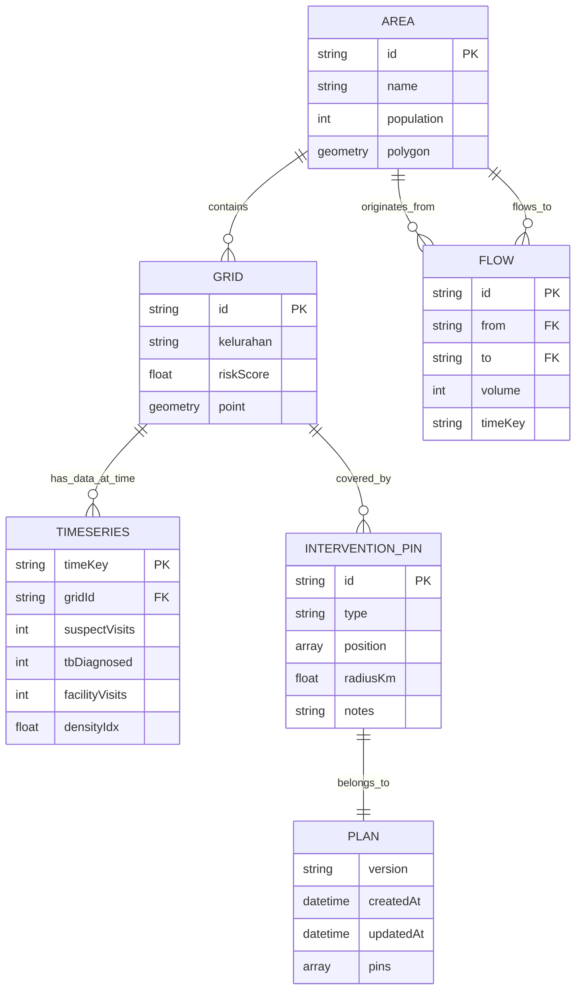

# Kerangka Konsep Sistem: TBC Hidden Cluster Map

## 📋 Executive Summary

**TBC Hidden Cluster Map** adalah sistem pemetaan berbasis web untuk deteksi dan perencanaan intervensi klaster TBC (Tuberkulosis) tersembunyi. Sistem ini dibangun dengan arsitektur **client-side only** (tanpa backend), mengandalkan React dan visualisasi peta interaktif untuk membantu praktisi kesehatan mengidentifikasi area berisiko tinggi dan merencanakan intervensi dengan cakupan optimal.

---

## 🎯 Tujuan & Objektif Sistem

### Tujuan Utama
1. **Deteksi Hidden Cluster**: Mengidentifikasi wilayah dengan transmisi TBC aktif yang belum terdeteksi oleh sistem surveilans rutin
2. **Analisis Gap**: Menemukan area dengan gap antara suspek (gejala tinggi) dan diagnosis konfirmasi
3. **Perencanaan Intervensi**: Membantu perencanaan penempatan titik intervensi (screening, edukasi, tracing) dengan coverage optimal
4. **Visualisasi Mobilitas**: Memahami pola pergerakan populasi yang berkontribusi pada penyebaran penyakit

### Objektif Sistem
- ✅ Visualisasi risiko multi-layer (choropleth, grid, heatmap)
- ✅ Analisis temporal (time-series) untuk identifikasi tren
- ✅ Rekomendasi cerdas berbasis algoritma untuk penempatan intervensi
- ✅ Privacy-by-design: data agregat tanpa PII
- ✅ Offline-capable: tidak memerlukan backend server

---

## 🏗️ Arsitektur Sistem

### 1. Arsitektur Aplikasi

```
┌─────────────────────────────────────────────────────────────┐
│                     BROWSER CLIENT                          │
│                                                             │
│  ┌─────────────────────────────────────────────────────┐   │
│  │              React Application Layer                 │   │
│  │  ┌──────────────────┐  ┌──────────────────────┐     │   │
│  │  │  Mobility View   │  │  Intervention Planner │     │   │
│  │  │  (Flow Analysis) │  │  (Coverage Planning)  │     │   │
│  │  └──────────────────┘  └──────────────────────┘     │   │
│  └─────────────────────────────────────────────────────┘   │
│                          ↕                                  │
│  ┌─────────────────────────────────────────────────────┐   │
│  │          Map Visualization Layer (Leaflet)           │   │
│  │  • AreaLayer (Kecamatan boundaries)                  │   │
│  │  • FlowLayer (Mobility OD arcs)                      │   │
│  │  • ClusterLayer (Auto-discovered clusters)           │   │
│  │  • PlannerLayer (Intervention pins + coverage)       │   │
│  └─────────────────────────────────────────────────────┘   │
│                          ↕                                  │
│  ┌─────────────────────────────────────────────────────┐   │
│  │              Utility & Algorithm Layer               │   │
│  │  • coverage.js (Haversine, grid coverage)            │   │
│  │  • recommend.js (Priority scoring)                   │   │
│  │  • storage.js (LocalStorage, undo/redo)              │   │
│  │  • importRisk.js (Risk aggregation)                  │   │
│  │  • clustering.js (DBSCAN algorithm)                  │   │
│  └─────────────────────────────────────────────────────┘   │
│                          ↕                                  │
│  ┌─────────────────────────────────────────────────────┐   │
│  │               Data Layer (Static JSON)               │   │
│  │  • areas.geojson (Kecamatan boundaries)              │   │
│  │  • grid.geojson (500m grid cells)                    │   │
│  │  • flows.json (Mobility OD pairs)                    │   │
│  │  • timeseries.json (Temporal grid data)              │   │
│  │  • facilities.json (Health facilities)               │   │
│  └─────────────────────────────────────────────────────┘   │
│                                                             │
│  ┌─────────────────────────────────────────────────────┐   │
│  │            LocalStorage (Persistent State)           │   │
│  │  • tbc_intervention_plan                             │   │
│  │  • tbc_intervention_history (undo stack)             │   │
│  └─────────────────────────────────────────────────────┘   │
└─────────────────────────────────────────────────────────────┘
```

### 2. Pola Arsitektur

**Pattern**: **JAMstack** (JavaScript, APIs, Markup)
- **JavaScript**: React 18 dengan hooks (useState, useMemo, useCallback)
- **APIs**: Static data served via fetch (no backend)
- **Markup**: Vite build system, deployment to CDN (Netlify/Vercel)

**Keuntungan**:
- ⚡ Performa tinggi (no server round-trip)
- 🔒 Privacy (no data transmission)
- 💰 Cost-effective (no server maintenance)
- 🌍 Scalable (CDN distribution)

---

## 📊 Model Data & Domain

### 1. Entitas Utama

#### **Area (Kecamatan)**
```javascript
{
  "type": "Feature",
  "properties": {
    "id": "area_01",
    "name": "Kecamatan Tamalate",
    "population": 180000,
    "notifRate": 43,      // TB notification rate per 100k
    "suspectedRate": 62   // Suspect visit rate
  },
  "geometry": {
    "type": "Polygon",
    "coordinates": [[[lng, lat], ...]]
  }
}
```

#### **Grid Cell (500m x 500m)**
```javascript
{
  "type": "Feature",
  "properties": {
    "id": "grid_00123",
    "kelurahan": "Mamajang",
    "riskScore": 0.72     // Computed risk 0-1
  },
  "geometry": {
    "type": "Point",      // Centroid
    "coordinates": [lng, lat]
  }
}
```

#### **Time-Series Data Point**
```javascript
{
  "2024-01": {
    "grid_00123": {
      "suspectVisits": 28,      // Kunjungan dengan gejala suspek TBC
      "tbDiagnosed": 5,         // Diagnosis konfirmasi TBC
      "facilityVisits": 145,    // Total kunjungan faskes
      "densityIdx": 0.68        // Proxy kepadatan populasi (0-1)
    }
  }
}
```

#### **Mobility Flow (Origin-Destination)**
```javascript
{
  "id": "flow_001",
  "from": "area_01",
  "to": "area_05",
  "volume": 120,            // Jumlah perjalanan
  "t": "2024-01",           // Time key
  "path": [[lng1, lat1], [lng2, lat2]]  // Arc coordinates
}
```

#### **Intervention Pin**
```javascript
{
  "id": "pin_1705312200000_abc123",
  "type": "Screening",      // "Screening" | "Edukasi" | "Tracing"
  "position": [-5.145, 119.42],
  "radiusKm": 1.0,
  "travelTimeMinutes": 30,
  "notes": "Dekat pasar, akses mudah",
  "createdAt": "2024-01-15T08:30:00.000Z"
}
```

### 2. Relasi Antar Entitas



---

## 🧮 Algoritma & Perhitungan Kunci

### 1. **Risk Score Calculation**

**Formula Risk Score Grid**:
```
riskScore = (suspectRate × 0.35) + (diagnosisRate × 0.25) + (gapRate × 0.25) + (visitRate × 0.15)

Dimana:
- suspectRate = min(suspectVisits / 30, 1)
- diagnosisRate = min(tbDiagnosed / 6, 1)
- visitRate = min(facilityVisits / 100, 1)
- diagnosisGap = max(0, suspectVisits - tbDiagnosed × 3)
- gapRate = min(diagnosisGap / 20, 1)
```

**Rationale**:
- **SuspectRate (35%)**: Indikator utama aktivitas transmisi
- **DiagnosisRate (25%)**: Konfirmasi kasus
- **GapRate (25%)**: Under-detection signal (gap besar = deteksi buruk)
- **VisitRate (15%)**: Proxy untuk kepadatan dan akses kesehatan

### 2. **Imported Risk Aggregation**

**Formula Imported Risk**:
```
importedRisk[to] = Σ (flow.volume × riskScore[from]) / totalInflowVolume[to]
```

**Konsep**: Area penerima mengimpor risiko dari area asal berdasarkan:
- Volume mobilitas (flow.volume)
- Risk score area asal
- Normalisasi terhadap total inflow

### 3. **Haversine Distance (Coverage Calculation)**

**Formula**:
```javascript
function haversineDistance(lat1, lng1, lat2, lng2) {
  const R = 6371; // Earth radius in km
  const dLat = toRadians(lat2 - lat1);
  const dLng = toRadians(lng2 - lng1);
  
  const a = sin(dLat/2)² + cos(lat1) × cos(lat2) × sin(dLng/2)²
  const c = 2 × atan2(√a, √(1-a))
  
  return R × c; // Distance in km
}
```

**Aplikasi**: Menentukan apakah grid cell berada dalam radius coverage pin intervensi.

### 4. **Priority Score (Recommendation Algorithm)**

**Formula**:
```
priorityScore = riskScore × coverageFactor × densityIdx × boostFactor

Dimana:
- coverageFactor = 1 jika belum tercakup, 0 jika sudah tercakup
- densityIdx = proxy kepadatan populasi (0-1)
- boostFactor = 1.2 jika riskScore > 0.7 dan belum tercakup, else 1.0
```

**Rationale**:
- Prioritas tertinggi: risiko tinggi + belum tercakup + kepadatan tinggi
- Booster untuk area sangat berisiko agar tidak terlewat

### 5. **Coverage Statistics**

**Metrics Computed**:
```javascript
{
  totalGrids: N,
  coveredGrids: C,
  uncoveredGrids: N - C,
  coveragePercent: (C / N) × 100,
  highRiskCovered: HR_C,        // High-risk grids covered
  highRiskTotal: HR_T,          // Total high-risk grids
  highRiskCoveragePercent: (HR_C / HR_T) × 100,
  estimatedPopulation: Σ(basePopPerGrid × densityIdx) for covered grids
}
```

### 6. **DBSCAN Clustering (Auto-Discovery)**

**Algoritma**:
```
DBSCAN(points, epsilon, minPoints):
  clusters = []
  visited = Set()
  
  for each point in points:
    if point in visited: continue
    visited.add(point)
    
    neighbors = getNeighbors(point, epsilon)
    if neighbors.length < minPoints:
      mark point as noise
    else:
      cluster = expandCluster(point, neighbors, epsilon, minPoints)
      clusters.add(cluster)
  
  return clusters
```

**Parameter Default**:
- epsilon = 0.05 (degrees, ~5.5km)
- minPoints = 2
- Threshold: hanya grid dengan riskScore ≥ 0.6

---

## 🎨 User Experience Flow

### **View 1: Mobility Analysis**

**User Journey**:
```
1. User memilih time key (bulan/tahun)
   ↓
2. Sistem menampilkan:
   - Flow arcs (OD mobility)
   - Import risk choropleth overlay
   ↓
3. User hover/click area → detail import risk breakdown
   ↓
4. User adjust filters:
   - Minimum flow volume
   - Max arcs displayed
   ↓
5. User click flow arc → detail flow (from, to, volume)
```

**Insight Gained**: 
- Wilayah mana yang menerima imported risk tinggi?
- Arus mobilitas mana yang paling signifikan?
- Apakah ada seasonal pattern dalam mobilitas?

### **View 2: Intervention Planner**

**User Journey**:
```
1. User switch ke mode "Planning"
   ↓
2. Sistem menampilkan:
   - Grid coverage layer (covered: hijau, uncovered: merah/oranye)
   - Recommendations sidebar (top 5 priority grids)
   ↓
3. User click peta → add intervention pin
   ↓
4. Sistem real-time update:
   - Coverage statistics
   - Uncovered high-risk grids
   - New recommendations
   ↓
5. User bisa:
   - Accept recommendation (auto-place pin)
   - Remove existing pins
   - Undo last action
   - Export plan to JSON
   - Import previous plan
   ↓
6. Plan auto-saved to LocalStorage
```

**Insight Gained**:
- Berapa grid tercakup dengan N titik intervensi?
- Estimasi populasi tercakup?
- Area mana yang masih prioritas belum tercakup?

---

## 🔒 Privacy & Ethics Design

### 1. **Privacy-by-Design Principles**

| Prinsip | Implementasi |
|---------|--------------|
| **Data Minimization** | Hanya simpan data agregat (grid/kecamatan level), tidak ada data individu |
| **Aggregate-only** | Semua visualisasi dalam bentuk agregat (minimum cell count implicit) |
| **No PII** | Tidak ada nama, alamat, nomor telepon, atau identifier personal |
| **Transparency** | Banner privasi di semua view, tooltip disclaimer |
| **Local-first** | Data tidak keluar dari browser (no backend, no analytics tracking) |

### 2. **Ethical Considerations**

**Do's**:
- ✅ Gunakan untuk perencanaan program kesehatan masyarakat
- ✅ Agregasi wilayah untuk identifikasi hotspot
- ✅ Transparency metodologi (open-source algorithms)

**Don'ts**:
- ❌ Gunakan untuk identifikasi atau stigmatisasi individu
- ❌ Asumsi kausalitas tanpa validasi epidemiologis
- ❌ Decision-making tanpa konfirmasi field data

### 3. **Data Quality Disclaimer**

Sistem ini menampilkan banner:
```
🛡️ Pernyataan Etik
Alat ini untuk perencanaan program publik. Data yang ditampilkan bersifat 
agregat wilayah (grid/kelurahan). Tidak ada data personal atau alamat individu.
```

---

## 🛠️ Stack Teknologi

### **Frontend Framework**
- **React 18**: Component-based UI, hooks API
- **React Leaflet 4**: Declarative map components
- **Leaflet 1.9**: Core map engine

### **Build & Dev Tools**
- **Vite 5**: Fast dev server, HMR, optimized builds
- **PostCSS**: CSS processing
- **TailwindCSS 3**: Utility-first CSS (optional, sebagian manual CSS)

### **Data Format**
- **GeoJSON**: Standard format untuk geometri area & grid
- **JSON**: Time-series, flows, facilities

### **Deployment**
- **Netlify/Vercel**: Static site hosting dengan CDN global
- **No backend**: Pure static files

---

## 📦 Struktur File & Modularisasi

```
tbc-hidden-cluster-map/
│
├── public/
│   └── data/
│       ├── areas.geojson          # Boundaries kecamatan
│       ├── grid.geojson           # 500m grid cells
│       ├── flows.json             # OD mobility flows
│       ├── timeseries.json        # Temporal grid data
│       └── facilities.json        # Health facilities (optional)
│
├── src/
│   ├── components/
│   │   ├── MapView.jsx            # Mobility view wrapper
│   │   ├── AreaLayer.jsx          # Kecamatan polygon layer
│   │   ├── FlowLayer.jsx          # OD arc polylines
│   │   ├── ClusterLayer.jsx       # Auto-discovered clusters
│   │   ├── PlannerLayer.jsx       # Intervention pins + coverage
│   │   ├── MobilitySidebar.jsx    # Sidebar for mobility view
│   │   ├── PlannerSidebar.jsx     # Sidebar for planner view
│   │   ├── Legend.jsx             # Map legend component
│   │   └── MapResizeHandler.jsx   # Leaflet resize fix
│   │
│   ├── utils/
│   │   ├── coverage.js            # Haversine, coverage calculation
│   │   ├── recommend.js           # Priority scoring, recommendations
│   │   ├── storage.js             # LocalStorage, undo/redo
│   │   ├── importRisk.js          # Risk aggregation from flows
│   │   ├── clustering.js          # DBSCAN algorithm
│   │   ├── dbscan.js              # Core DBSCAN implementation
│   │   ├── scoring.js             # Risk score calculation
│   │   └── centroid.js            # Polygon centroid calculation
│   │
│   ├── App.jsx                    # Main application component
│   ├── main.jsx                   # Entry point
│   ├── styles.css                 # Global styles
│   └── index.css                  # Tailwind imports
│
├── package.json
├── vite.config.js
├── netlify.toml                   # Netlify deployment config
├── vercel.json                    # Vercel deployment config
│
├── README.md                      # User-facing documentation
├── FEATURES.md                    # Feature documentation
├── INTERVENTION_PLANNER.md        # Planner deep-dive
└── KERANGKA_KONSEP_SISTEM.md      # This document
```

---

## 🔄 Data Flow & State Management

### **State Architecture**

```
┌────────────────────────────────────────┐
│          App.jsx (Root State)          │
├────────────────────────────────────────┤
│  • currentView: VIEWS.MOBILITY|PLANNER │
│  • timeKey: "2024-01"                  │
│  • plan: { pins: [...] }               │
│  • areas, grids, flows, timeseries     │
└────────────────────────────────────────┘
              ↓         ↓
    ┌─────────┘         └─────────┐
    ↓                               ↓
┌──────────────────┐   ┌────────────────────┐
│ MobilitySidebar  │   │  PlannerSidebar    │
│ + MapView        │   │  + PlannerMap      │
│                  │   │                    │
│ • layers         │   │  • mode            │
│ • filters        │   │  • selectedPinId   │
│ • selectedArea   │   │  • coverageStats   │
│ • selectedFlow   │   │  • recommendations │
└──────────────────┘   └────────────────────┘
```

### **Computed Values (useMemo)**

| State | Dependencies | Computation |
|-------|--------------|-------------|
| `riskById` | `timeseries`, `timeKey` | Aggregate risk per area from timeseries |
| `importRiskById` | `filteredFlows`, `riskById` | Sum weighted risk from inbound flows |
| `filteredFlows` | `flows`, `timeKey`, `filters` | Filter by time + volume threshold |
| `coverageStats` | `grids`, `plan.pins`, `timeseries`, `timeKey` | Count covered/uncovered grids |
| `recommendations` | `grids`, `timeseries`, `timeKey`, `coverageSets` | Top 5 priority grids |

**Rationale**: Caching expensive calculations, re-run hanya ketika dependencies berubah.

---

## 🚀 Deployment & Scalability

### **Build Process**
```bash
npm install          # Install dependencies
npm run build        # Vite build → dist/
npm run preview      # Local preview of production build
```

**Output**: Static files di folder `dist/`
- `index.html`
- `assets/index-[hash].js`
- `assets/index-[hash].css`
- `data/*.json`, `data/*.geojson`

### **Deployment Target**

**Option 1: Netlify**
```toml
# netlify.toml
[build]
  publish = "dist"
  command = "npm run build"

[[redirects]]
  from = "/*"
  to = "/index.html"
  status = 200
```

**Option 2: Vercel**
```json
// vercel.json
{
  "buildCommand": "npm run build",
  "outputDirectory": "dist",
  "rewrites": [{ "source": "/(.*)", "destination": "/index.html" }]
}
```

### **Scalability Considerations**

| Aspek | Skalabilitas | Limitasi |
|-------|-------------|----------|
| **Data Size** | JSON bundled dengan app, OK untuk <10MB total data | Jika data >50MB, perlu lazy loading |
| **Concurrent Users** | Unlimited (static CDN) | None (no backend bottleneck) |
| **Computation** | Client-side (user's device) | Slow devices may lag dengan >10k grids |
| **Storage** | LocalStorage (5-10MB limit) | Intervention plans harus kecil |

**Optimasi**:
- Lazy load time-series per time key (fetch on demand)
- WebWorker untuk DBSCAN clustering (avoid UI freeze)
- Virtualized lists untuk 1000+ recommendations

---

## 📈 Metrics & KPIs

### **System Performance KPIs**

| Metric | Target | Measurement |
|--------|--------|-------------|
| **Initial Load Time** | < 3s | Time to interactive |
| **Map Render Time** | < 500ms | Leaflet layer rendering |
| **Coverage Calculation** | < 200ms | 5000 grids × 50 pins |
| **Recommendation Generation** | < 300ms | Priority scoring 5000 grids |
| **Undo/Redo Latency** | < 100ms | LocalStorage read/write |

### **Public Health Impact KPIs** (Tracked Externally)

| Metric | Definition |
|--------|------------|
| **Coverage Rate** | % grid tercakup intervensi |
| **High-Risk Coverage** | % grid berisiko tinggi yang tercakup |
| **Detection Gap Reduction** | Δ (suspectVisits - tbDiagnosed) before vs after |
| **Intervention Efficiency** | Populasi tercakup / jumlah titik intervensi |

---

## 🧪 Testing Strategy

### **Unit Tests** (Recommended)
```javascript
// coverage.test.js
test('haversineDistance calculates correct distance', () => {
  const distance = haversineDistance(-5.145, 119.42, -5.152, 119.435);
  expect(distance).toBeCloseTo(1.2, 1); // ~1.2 km
});

// recommend.test.js
test('generateRecommendations returns top N uncovered grids', () => {
  const recs = generateRecommendations(mockGrids, mockTimeseries, '2024-01', coveredSet, 5);
  expect(recs).toHaveLength(5);
  expect(recs[0].score).toBeGreaterThan(recs[1].score);
});
```

### **Integration Tests**
- Test full user flow: add pin → coverage updates → recommendation refresh
- Test import/export plan cycle
- Test undo/redo chain

### **Manual Testing Checklist**
- [ ] Load all views without errors
- [ ] Add 50 pins → coverage calculation still fast
- [ ] Switch time keys → flow arcs update correctly
- [ ] Export plan → import plan → state restored
- [ ] Privacy banner visible on all views

---

## 🔮 Future Enhancements

### **Phase 2 Features**
1. **Predictive Modeling**: Machine learning untuk prediksi cluster berikutnya
2. **Route Optimization**: TSP solver untuk urutan kunjungan intervensi
3. **Multi-Disease Support**: Extend untuk dengue, malaria, dll
4. **Collaborative Planning**: Real-time sync antar users (via WebRTC atau Firebase)
5. **Mobile App**: React Native port dengan offline-first sync

### **Phase 3: Analytics Integration**
- Anonymous usage analytics (GDPR-compliant)
- A/B testing untuk UX improvements
- Feedback loop dari field teams

### **Technical Debt**
- Migrate dari manual CSS ke full TailwindCSS
- Add TypeScript untuk type safety
- WebWorker untuk heavy computations
- IndexedDB untuk storage >10MB

---

## 📚 Glossary

| Term | Definisi |
|------|----------|
| **Hidden Cluster** | Klaster transmisi TBC aktif yang belum terdeteksi oleh sistem surveilans rutin |
| **Gap Analysis** | Analisis selisih antara suspek (gejala) dan diagnosis konfirmasi |
| **Imported Risk** | Risiko yang dibawa ke suatu area dari area lain melalui mobilitas populasi |
| **Coverage** | Persentase grid/area yang berada dalam radius intervensi |
| **Priority Score** | Skor gabungan dari risiko, kepadatan, dan status coverage untuk rekomendasi |
| **OD Flow** | Origin-Destination flow: perjalanan dari area asal ke area tujuan |
| **DBSCAN** | Density-Based Spatial Clustering of Applications with Noise |
| **Haversine** | Formula untuk menghitung jarak great-circle antara dua titik di permukaan bola |

---

## 🤝 Kontributor & Maintenance

### **Roles**
- **Product Owner**: Dinas Kesehatan / TB Program Manager
- **Developer**: Frontend engineer (React specialist)
- **Data Scientist**: Risk modeling, validation
- **Field Team**: User testing, feedback

### **Update Cycle**
1. **Data Update**: Monthly (timeseries.json)
2. **Feature Update**: Quarterly (new features)
3. **Bug Fixes**: On-demand (via GitHub Issues)

---

## 📞 Support & Documentation

- **User Guide**: `README.md`, `QUICK_START.md`
- **Feature Docs**: `FEATURES.md`
- **Planner Guide**: `INTERVENTION_PLANNER.md`
- **System Concept**: `KERANGKA_KONSEP_SISTEM.md` (this document)
- **GitHub Issues**: Bug reports & feature requests
- **Email Support**: (configure as needed)

---

## 🏁 Conclusion

Sistem **TBC Hidden Cluster Map** adalah solusi inovatif untuk deteksi dan perencanaan intervensi TBC dengan karakteristik:

✅ **Privacy-first**: Data agregat, no PII, local-only processing  
✅ **User-friendly**: Visualisasi intuitif, rekomendasi cerdas  
✅ **Scalable**: Static deployment, no backend cost  
✅ **Evidence-based**: Algoritma transparan, validasi epidemiologis  
✅ **Actionable**: Langsung menghasilkan intervention plan

**Target Users**: TB Program Manager, Epidemiolog, Dinas Kesehatan, Field Coordinator

**Impact**: Meningkatkan efisiensi deteksi cluster dan cakupan intervensi TBC, berkontribusi pada eliminasi TBC 2030.

---

**Dokumen ini adalah panduan komprehensif untuk developer dan stakeholder memahami sistem secara mendalam.**

**Last Updated**: 2024-02-06  
**Version**: 1.0  
**Author**: System Architect
